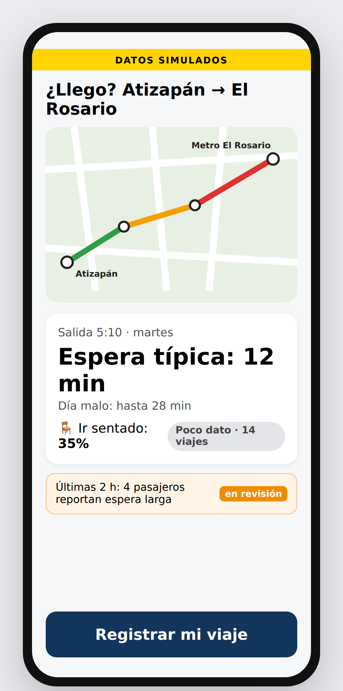
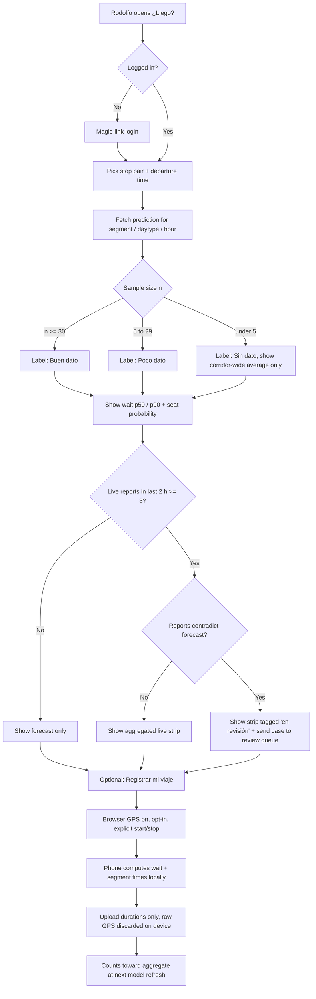
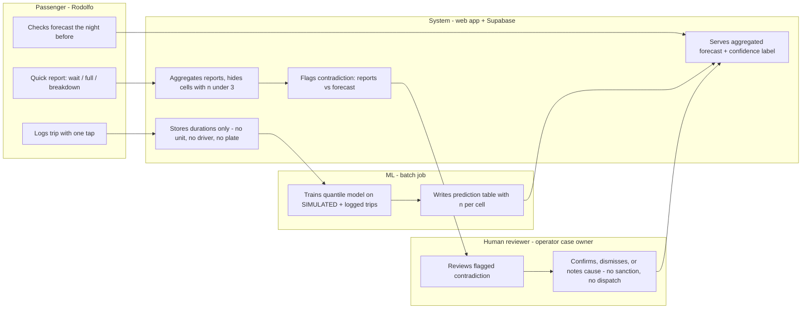

# PACKET: Week 7, Nico (role: User), Team 4

**Chapter:** *The Holy Driver* · **Stack floor:** 🐉 DRAGON STACK (maps + ML + phone telemetry)
**Declaration (Blueprint):** Route/time reliability view for Rodolfo, built on aggregated reports with uncertainty labels. **Honors Condition 3.**
**Working name:** **¿Llego?** (a reliability view for one Atizapán corridor)

> All trip data in this build is **SIMULATED** and labeled on screen. No real passengers, drivers or vehicle units appear anywhere.

---

## 1. Problem (in my words)

Rodolfo is a professional driver. He does not drive to work: he commutes from Atizapán, Estado de México, on public transport. He gets up at 4am to start at 7. That buffer is almost three hours, and he pays for it because the colectivo is unpredictable. Units break down, the first one that passes may be full, and some days he rides standing the whole way.

Nobody can tell him how long the wait will be at 5:10 on a Tuesday, or whether he'll find a seat. No official feed exists for this corridor, Google Maps has no real-time data for it, and the only information is what he remembers from past trips. So he adds margin to cover the worst case, and he pays for that margin in sleep every day.

**The problem:** the information on how reliable the corridor is at a given time already exists, scattered across passengers' experience, but nobody collects it, adds it up, or shows it honestly.

## 2. Exact user

**Rodolfo**, a real person Nico knows. He's a professional driver who commutes daily from Atizapán on public transport, wakes up at 4am, starts at 7, deals with frequent breakdowns and usually rides without a seat.

- **When it hurts:** the night before (what time to set the alarm) and at the stop (wait or switch routes?).
- **Current workaround:** leave hours early "just in case." The cost is sleep, and it adds up to hours every week.
- **Evidence status:** secondhand. Nico knows the facts, but we don't have a direct quote from Rodolfo yet. **Open item:** get one sentence from him in his own words before the demo video.

## 3. Success definition

> **Before the module closes:** Rodolfo opens the live URL, picks his stop pair and a departure time, and sees an expected wait with a range (typical / bad day), the chance of getting a seat, and an honest confidence label. He can then log his own trip with one tap and see it counted in the aggregate. The view never shows him, or anyone else, an individual driver, unit or plate.

Measurable:
- Picking a stop pair and time and getting a prediction takes **≤ 3 taps**.
- Every prediction shows a **confidence label** (`Buen dato` / `Poco dato` / `Sin dato`) and the sample size.
- Aggregated live reports appear **only when n ≥ 3** in the time window (k-threshold).
- A report that contradicts the model goes to a **human review queue** and is never silently applied (Condition 3).

## 4. Mockup (image-generated)

The main forecast screen, generated from the prompt below. AI-generated version (Canva): https://www.canva.com/M/MAHWdN-J4hQ. The file embedded here is the same screen at full resolution, with legible Spanish text.

**Prompt used:**
> Mobile web app screen, Spanish UI, clean and high-contrast, large type for a tired early-morning commuter. Top: small yellow banner "DATOS SIMULADOS". Header: "¿Llego? Atizapán → El Rosario". A simple street map showing one route line with 4 stops, segments colored green/amber/red by delay, and no vehicle icons. Below the map, a big card: "Salida 5:10 · martes", "Espera típica: 12 min", "Día malo: hasta 28 min", "Probabilidad de ir sentado: 35%", a small grey pill "Poco dato · 14 viajes". Under it, a strip "Últimas 2 h: 4 pasajeros reportan espera larga" with a small tag "en revisión". A large bottom button "Registrar mi viaje". Flat design, Android phone frame, no brand logos.

## 5. Flow

### 5a. How the feature works (flowchart)

### 5b. Who does what (swimlane)

## 6. Benchmark

**The best existing solution on Earth for this is** the Transit app's GO crowdsourcing. Riders opt in while navigating, which gives real-time locations for vehicles that have no official feed, and one-tap crowding reports are combined with ridership-based crowding predictions. For informal networks specifically, Digital Matatus (Nairobi) and WhereIsMyTransport showed that phone-collected route data can make minibus systems legible.

**Mine differs or localizes by:** a single Atizapán colectivo corridor with no agency feed at all, and **reliability shown only in aggregate with explicit uncertainty**. There are no individual vehicle icons, no leaderboards and no per-unit tracking, because in this corridor a visible unit is a driver who can be punished (Condition 3, Shadow Clause).

## 7. Long view (3 years)

If this slice works, ¿Llego? becomes the honest reliability layer for Mexico City's metropolitan colectivo corridors. Passenger-contributed durations and paid, verified driver hazard reports (Rodrigo's and Diego's slices) feed one published dashboard per corridor, which operators and the transport authority use to fix the worst hours and segments. The load-bearing wall that stays fixed: **the data describes routes and hours, never workers**. That is what makes drivers willing to join instead of fighting it, and it's why the schema has no column that could ever identify a unit.

## 8. Scope cut (what I'm NOT building)

- ❌ Ride-hailing, booking or dispatch of any kind (forbidden zone).
- ❌ Individual vehicle tracking, unit IDs, plates, driver names or driver scores. These columns don't exist.
- ❌ Driver-side app, hazard-report payments, closure ledger (Rodrigo's and Diego's slices).
- ❌ Budget and go/no-go dashboard (Valeria's slice).
- ❌ Continuous or background location. GPS runs only between an explicit start and stop tap.
- ❌ Real data. The whole seed is simulated and labeled.
- ❌ Multi-corridor support. One corridor with 4 stops and 3 segments.
- ❌ Native app. Mobile web only, so it works on older Android phones without an install.

## 9. Architecture + stack

**Corridor:** `Atizapán (Stop A) → B → C → Metro El Rosario (Stop D)`. **This is a placeholder:** the real stop pair has to be confirmed with Rodolfo (Blueprint Condition 1). Coordinates live in one config file so swapping them takes a single commit.

| Layer | Choice (free tier) | Why |
|---|---|---|
| Frontend | Next.js (App Router) + Tailwind, deployed on Vercel | Same stack as Weeks 2–6; mobile-first |
| **Maps / geodata** 🗺️ | MapLibre GL JS + OpenStreetMap tiles; corridor as GeoJSON | Free, no API key; segments colored by predicted delay |
| Backend / DB | Supabase (Postgres + Auth + RLS) | Auth and RLS are required by the security floor |
| **ML** 🤖 | Python + scikit-learn `GradientBoostingRegressor` (quantile loss p50 / p90) for wait time; `GradientBoostingClassifier` for seat probability. A batch script writes a `predictions` table | Quantile model gives uncertainty directly. It runs offline, so there is no server cost |
| **Phone telemetry** 📱 | Browser Geolocation API (`watchPosition`) during an explicit trip; client-side snapping to the corridor's stops | Third Dragon component; no install; raw trail never leaves the phone |
| Simulated data | `scripts/simulate_trips.py` generates 90 days of trips (hour, daytype, segment, rain, breakdown events) | Labeled "SIMULADO" in the UI and in the DB (`is_simulated = true`) |
| Tests | Vitest (unit), Playwright (one happy path) | Mechanical pass |

### Data model (no worker-identifying fields by design)

| Table | Columns | RLS |
|---|---|---|
| `stops` | id, name, lat, lng, seq | read: authenticated |
| `trips` | id, user_id, stop_from, stop_to, daytype, hour, wait_min, ride_min, got_seat, is_simulated, created_at | insert: own `user_id` only · select: own rows only |
| `reports` | id, user_id, stop_id, kind (`long_wait` / `full` / `breakdown`), created_at, expires_at (+2h) | insert: own · select: none directly |
| `predictions` | segment, daytype, hour, wait_p50, wait_p90, seat_prob, n_obs, model_version | read: authenticated · write: service role (batch job) only |
| `review_cases` | id, stop_id, window, forecast_p50, report_count, status, reviewer_note | read/write: `reviewer` role only |
| view `live_reports_agg` | stop_id, kind, count over last 2h, **hidden where count < 3** | read: authenticated (security-definer function) |

There is **no** `vehicle_id`, `unit`, `plate` or `driver` column anywhere. Condition 3 and the Shadow Clause are enforced in the schema, not just in the UI.

**Retention:** `reports` expire after 2 hours from the live view and are deleted after 30 days. Users can delete their own `trips` from a "Mis viajes" screen (Condition 4: correctable, limited retention).

### Uncertainty labels

| n_obs in cell | p90 − p50 width | Label shown |
|---|---|---|
| ≥ 30 | any | `Buen dato · n viajes` |
| 5–29 | any | `Poco dato · n viajes` |
| < 5 | – | `Sin dato` + corridor-wide average, greyed out |

A **contradiction** is live report count ≥ 3 of `long_wait` while the forecast p50 is under 10 min, or the opposite. When that happens the system creates a `review_cases` row and the UI tags the strip `en revisión`. The forecast is never altered automatically.

## 10. Security floor (read before building)

- [ ] Supabase Auth (magic link); every page except landing requires a session.
- [ ] RLS enabled on **every** table; policies as in the table above; verified with a second test account.
- [ ] No keys in code: `.env.local` is in `.gitignore`; keys live in Vercel env vars; only the anon key is exposed to the client, and the service role is used only in the batch script.
- [ ] No real people's data: the seed is 100% simulated, `is_simulated = true`, and there's a yellow "DATOS SIMULADOS" banner on every screen.
- [ ] Location consent screen before the first GPS use, explaining what is kept (durations) and what isn't (the trail).

## 11. Test plan

### Mechanical pass
| # | Test | Expected |
|---|---|---|
| T1 | Unauthenticated user opens `/corridor` | Redirect to login |
| T2 | User A queries `trips` of user B via the client | 0 rows (RLS) |
| T3 | Prediction for a cell with n = 3 | Label `Sin dato`, greyed |
| T4 | 2 reports in window | Live strip hidden |
| T5 | 3 `long_wait` reports while p50 = 6 min | Strip shows `en revisión`; `review_cases` row created; forecast unchanged |
| T6 | Grep the schema and payloads for `vehicle`, `unit`, `plate`, `driver` | No matches |
| T7 | Log a trip with GPS; inspect the network payload | Only durations and stop IDs, no lat/lng array |
| T8 | Throttle to "Slow 3G" in DevTools | Forecast still renders from cached prediction; trip upload retries |
| T9 | Model sanity: p90 ≥ p50 in every cell | Pass |
| T10 | Delete a trip from "Mis viajes" | Row gone; excluded at next refresh |

Goal: find **at least one bug**, fix it, redeploy, and log it in `DECISIONS.md`.

### Persona test (Layer 1)
Fresh chat. Persona built from what we know about Rodolfo. Anything not confirmed is marked as an assumption and should be checked with him:

> *You are Rodolfo, a professional driver who lives in Atizapán, Estado de México. You wake at 4am to start work at 7 and get there by colectivo; units often break down and you usually ride standing. You're tired in the morning and checking your phone at the stop, maybe one-handed while holding on. [Assumptions to verify: Android phone, WhatsApp daily, limited data plan, doesn't trust apps that "track" him — as a driver himself, anything that looks like surveillance of drivers bothers you.] Attempt the task: find out how long you'll wait tomorrow at 5:10 and log today's trip. Narrate out loud where you hesitate, what you don't understand, and where you'd quit.*

Paste screenshots in order: landing → login → corridor pick → forecast → live strip → consent → trip logging → Mis viajes. Log every confusion in `docs/PERSONA_LOG.md`, fix the worst one, and redeploy.

## 12. Build rules for the week

- Minimum **5 commits, 2 deploys** (Deploy 1 = static forecast from simulated predictions; Deploy 2 = live reports + review queue + trip logging + persona fix).
- Every session ends with the Session Close: update `DECISIONS.md`, note tomorrow's first move, commit, push.
- Open items: ① confirm the real stop pair with Rodolfo, ② get one direct quote from him.
- Build prompt for the coding agent: `docs/BUILD_PROMPT.md`.
